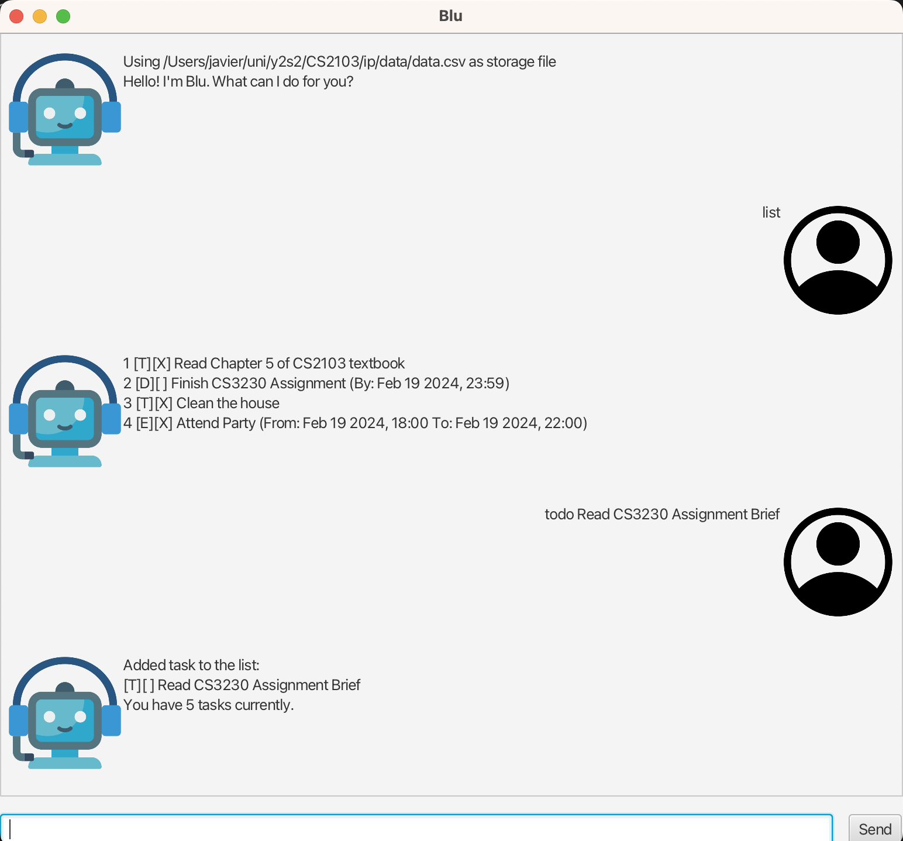

# Blu User Guide
Blu is a desktop application for managing tasks, optimized for use via a Command Line Interface (CLI) while still having the benefits of a Graphical User Interface (GUI). If you can type fast, Blu can allow task management to be done faster than traditional GUI apps.

- [Quick Start](#quick-start)
- [Features](#features)
    - [Command Format](#command-format)
    - [Adding a ToDo](#adding-a-todo-todo)
    - [Adding a Deadline](#adding-a-deadline-deadline)
    - [Adding an Event](#adding-an-event-event)
    - [Listing all tasks](#listing-all-tasks-list)
    - [Marking a task as completed](#marking-a-task-as-completed-mark)
    - [Unmarking a task as not completed](#unmarking-a-task-as-not-completed-unmark)
    - [Deleting a task](#deleting-a-task-delete)
    - [Finding tasks by titles](#finding-tasks-by-titles-find)
- [Task Storage Format](#task-storage-format)
    - [CSV Format](#csv-format)

## Quick Start
1. Ensure you have Java 11 installed in your computer.
2. Download the latest `blu.jar` from [here](https://github.com/Javiery3889/ip/releases).
3. Copy the file to the directory you want to use as the *home folder* for your Blu application.
4. Open a command terminal, `cd` into the directory where `blu.jar` is in, and use the `java -jar blu.jar` command to run the application.
> [!NOTE]
> Blu will prompt you to select a CSV file to store the task list, Blu will create `./data/data.csv` if no file is selected.
5. After a storage file has been selected, A GUI similar to the below should appear in a few seconds.



## Features
### Command Format
Blu uses the following command format:
```
command POSITIONAL_PARAMETER /NAMED_PARAMETER NAMED_PARAMETER_VALUE
``` 

- Words in `UPPER_CASE` are the parameters to be supplied by the user.
- `command` is case-insensitive.
- Named parameters are **case-sensitive** and must be followed in the order specified for each `command`.
### Adding a ToDo: `todo`
Adds a task without any date/time attached to the task list.

Format: `todo TODO_TITLE`

Example: `todo Read Book`
### Adding a Deadline: `deadline`
Adds a task that need to be done before a specific date/time to the task list.

Format: `deadline DEADLINE_TITLE /by DATETIME`
- `DATETIME` must be supplied in the following format: `dd-mm-yyyy HH:MM`, e.g. `20-02-2024 09:00`.

Example: `deadline submit report /by 20-02-2024 09:00`
### Adding an Event: `event`
Adds a task start at a specific date/time and ends at a specific date/time to the task list.

Format: `event EVENT_TITLE /from FROM_DATETIME /to TO_DATETIME`
- `FROM_DATETIME`and `TO_DATETIME` must be supplied in the following format: `dd-mm-yyyy HH:MM`, e.g. `20-02-2024 09:00`.

Example: `event project meeting /from 20-02-2024 10:00 /to 20-02-2024 12:00`
### Listing all tasks: `list`
Shows all tasks added to the task list
Format: `list`
### Marking a task as completed: `mark`
Marks a specified task as completed.

Format: `mark INDEX`
- Marks the task at the specified `INDEX`
- The index refers to the index number shown in the displayed task list.
- The index **must be a positive integer** e.g. 1, 2, 3, ...
Example: `list` followed by `mark 1` marks the first task of the task list as completed.
### Unmarking a task as not completed: `unmark`
Unmarks a specified task as not completed.

Format: `unmark INDEX`
- Unmarks the task at the specified `INDEX`
- The index refers to the index number shown in the displayed task list.
- The index **must be a positive integer** e.g. 1, 2, 3, ...
Example: `list` followed by `unmark 2` unmarks the second task of the task list as not completed.
### Deleting a task: `delete`
Deletes a specified task in the task list.

Format: `delete INDEX`
- deletes the task at the specified `INDEX`
- The index refers to the index number shown in the displayed task list.
- The index **must be a positive integer** e.g. 1, 2, 3, ...

Example: `list` followed by `delete 3` deletes the second task of the task list.
### Finding tasks by titles: `find`
Finds tasks that whose titles contain the given substring.

Format: `find SUBSTRING`
- The search is **case-sensitive**.
- Only the title is searched.
- All tasks containing the substring will be displayed.
    - The index **cannot be used** for other operations such as delete and mark, user should use `list` to get the index of the task
Example: `find CS2103` returns all tasks that contain `CS2103` in their associated title.
### Exiting the program: `bye`
Exits the program.

Format: `bye`
## Task Storage Format
Tasks are saved automatically as CSV file, specified by the user at the start of the program. By default, Blu will create `[JAR file location]/data/data.csv` if not file is chosen.
### CSV format
```
Task_Type,Completed,Task_Title
```
- Task_Type: `E/D/T` abbreviated for Event/Deadline/ToDo respectively.
- Completed: `T/F` abbreviated for True/False respectively.
- Task_Title: Task title associated to the task.